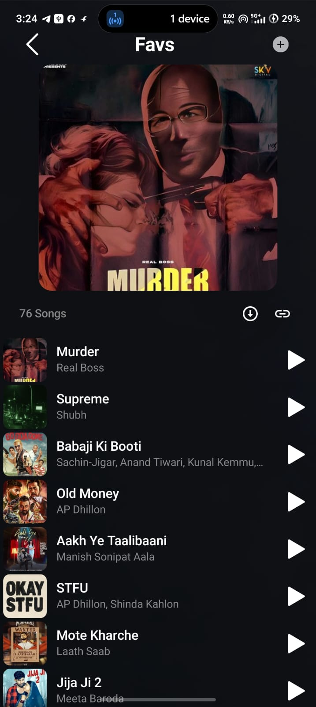

# 🎵 Clef

<p align="center">
  <h1 align="center">🎵 Clef</h1>
  <p align="center">
    A modern Android music player designed for a smooth and simple music experience.
  </p>
</p>

---

## 📱 Screenshots

<p align="center">
  
  
  
  
</p>

---

## 📖 About the App

**Clef** is a modern Android music application focused on providing a clean, simple, and enjoyable music experience.

The app features an intuitive interface that makes it easy to navigate through your music and control playback.

---

## ✨ Features

- 🎵 Music playback
- 🎧 Modern music player interface
- 📱 Clean and responsive UI
- 🔍 Easy navigation
- ⚡ Lightweight and fast
- 🎨 Modern Android design

---

## 📥 Download APK

<p align="center">

### 👉 [⬇️ Download Clef 1.0 APK](./Clef%201.0.apk)

</p>

> **Note:** Download the APK and install it on your Android device to try the application.

---

## 🛠️ Built With

- **Android Studio**
- **Kotlin / Java**
- **XML**
- **Android SDK**
- **Gradle**

---

## 📂 Repository Structure

```text
📦 Clef
│
├── 📁 Key Store
├── 📁 Music android App
├── 📁 Photots
│
├── 🖼️ 01.jpg
├── 🖼️ 02.jpg
├── 🖼️ 03.jpg
├── 🖼️ 04.jpg
├── 🖼️ 05.jpg
├── 🖼️ 06.jpeg
│
├── 📱 Clef 1.0.apk
├── 📄 .gitignore
└── 📄 README.md
